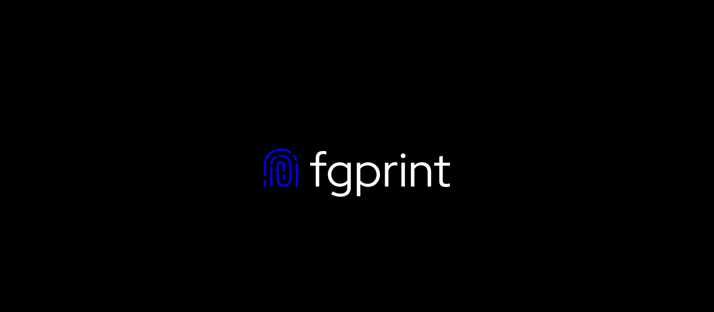

# Welcome to **fgprint** - an advanced fingerprinting library


[](https://www.npmjs.com/package/@neurosell/fgprint)
[](./LICENSE)

**fgprint** - The most powerful, fast, and convenient library for browser and device fingerprinting in pure TypeScript.

---

**Zero dependencies** · **Modern architecture** · **100% Typed** · **Extendable**

---

## 📖 Table of contents

---

## 🚀 Why fgprint?
Most fingerprinting libraries are either outdated, use a limited set of signals, or have bloated dependencies. **Fgprint** was built from the ground up to be:
- **Full-featured**: collects **over 30 stable** and unique signals, including WebGPU, WebCodecs, Canvas, AudioContext, WebGL, fonts, math artifacts, and many others.
- **Fast**: a synchronous fingerprint is calculated in <10 ms, an asynchronous fingerprint in 100–300 ms.
- **Client side** - no required API keys or payments;
- **Modular**: you can use only the components you need or add your own.
- **Typed**: written on pure TypeScript with type preservation in all public methods.
- **Independent**: dependency free, works even in the most confined environments.

---

## ✨ Features list
### 🧩 Unique signals
- **Basic**: Navigator, Screen, Timezone, Plugins;
- **Graphics**: Canvas, WebGL, WebGPU;
- **Audio**: AudioContext with dynamic buffer;
- **System**: Networking, performance, fonts, virtual keyboard;
- **Extended**: Math Precision, CSS-properties;

### ⚡ Performance and reliability
- Built-in results caching;
- Configurable timeouts for asynchronous operations;
- Robust data normalization (e.g. rounding of screen sizes);
- Sync and Async modes;
- SHA-512 cached fingerprints;

### 🧪 For developers
- Full typing with autocompletion in the IDE
- Clear OOP design with abstract class `FingerprintComponent`
- Component getters with generics: `fp.getComponent<CanvasFingerprinter>('canvas')`
- Ready-to-use demo with visual debugging

---

## Comparison with analogues
| Characteristic         | fgprint            | FingerprintJS | ClientJS      | CreepJS (browser extension) |
|------------------------|--------------------|---------------|---------------|-----------------------------|
| **Signals**            | **30+**            | ~20           | ~15           | ~40+                        |
| **WebGPU / WebCodecs** | ✅                  | ❌             | ❌            | ✅ (partial)                 |
| **Audio Fingerprint**  | ✅ (no sound)       | ✅             | ❌            | ✅                           |
| **Math**               | ✅                  | ❌             | ❌            | ✅                           |
| **Caching**            | ✅                  | ✅             | ❌            | ❌                           |
| **Typed (TypeScript)** | ✅                  | ✅             | ❌            | ❌                           |
| **Size (min+gzip)**    | **~7 KB**          | ~14 KB        | ~10 KB        | N/A                         |
| **Modular**            | ✅ (any components) | ⚠️ (fixed)    | ❌       | ✅                           |
| **Dependencies**       | **0**              | 0             | 0             | -                           |

---

## Get started
### 📦 Installation
**Installation using NPM:**
```bash
npm install @neurosell/fgprint
```

**Or using GitHub:**
```bash
git clone https://github.com/devsdaddy/fgprint
cd ./fgprint
```

### 🏁 Simple usage
```typescript
import { Fingerprint } from "@neurosell/fgprint";

/* Create basic fingerprint */
const fp = Fingerprint.createDefault();
const fingerprint = await fp.getFingerprint();
console.log('Full fingerprint:', fingerprint);
```

### 🔧 Advanced usage
**Components selection:**
```typescript
import { Fingerprint, NavigatorFingerprint, CanvasFingerprint } from '@neurosell/fgprint';

const fp = new Fingerprint({
  components: [
    new NavigatorFingerprint(),
    new CanvasFingerprint(),
  ],
  exclude: [],                // Exclude components
  timeout: 2000,              // Async operations timeout
  debug: false,               // Debug data
});

const hash = await fp.getFingerprint();
```

**Access to component data:**
```typescript
// Get registred component with type
const webgl = fp.getComponent<WebGLFingerprint>('webgl');
if (webgl) {
  const data = webgl.getData(); // Has data
  console.log('GPU:', data.unmaskedRenderer);
}

// Get directly typed data from component
const navData = await fp.getComponentDataTyped<{ userAgent: string }>('navigator');
console.log(navData?.userAgent);
```

**Create your own signals:**
```typescript
import { FingerprintComponent } from '@neurosell/fgprint';

class MyComponent extends FingerprintComponent<string> {
  name = 'myComponent';
  
  public override getData() {
    return 'custom data';
  }
}

fp.registerComponent(new MyComponent());
```

---

## 📋 Components list

> **Note:** Asynchronous components are automatically handled with a timeout, and their failure does not affect the final print.

| Component | Mode  | Description                                                    |
|------|-------|----------------------------------------------------------------|
| ``NavigatorFingerprint`` | Sync  | User agent, platform, languahes. harware etc.                  |
| ``ScreenFingerprint`` | Sync  | Screen size, color depth, orientation etc.                     |
| ``TimezoneFingerprint`` | Sync  | Timezone information                                           |
| ``PluginsFingerprint`` | Sync  | Browser plugins                                                |
| ``CanvasFingerprint`` | Sync  | Canvas fingerprint based on GPU/OS                             |
| ``WebGLFingerprint`` | Sync  | WebGL Features                                                 |
| ``FontsFingerprint`` | Sync  | List of available fonts                                        |
| ``MiscFingerprint`` | Sync  | Additional small signals (touch support, pointer events etc.)  |
| ``AudioFingerprint`` | Async | An unique audio-fingerprint based on signal generator          |
| ``MediaDevicesFingerprint`` | Async  | (**require user permission!**) list of cameras, mics etc.      |
| ``NetworkFingerprint`` | Sync  | Connection type, RTT, downlink, saveData                       |
| ``WebGPUFingerprint`` | Async  | GPU information based on modern WebGPU API                     |
| ``WebCodecsFingerprint`` | Async  | List of codecs                                                 |
| ``PerformanceFingerprint`` | Sync  | (unique) Memory usage from JS-heap and speed of math functions |
| ``MathPrecisionFingerprint`` | Sync  | Compute artifacts of some math functions                       |
| ``SensorFingerprint`` | Sync  | Sensors availability                                           |
| ``GamepadFingerprint`` | Sync  | Gamepad list info                                              |
| ``SpeechSynthesisFingerprint`` | Sync  | Speech synthesis fingerprint                                   |
| ``CSSFeaturesFingerprint`` | Sync  | CSS features list                                              |

---

## 🖥️ Demo and Debug
The repository contains a ``demo/`` folder with a ready-made page for visual testing.

```bash
git clone https://github.com/devsdaddy/fgprint.git
cd ./fgprint
npm install
npm run build:demo
npx serve demo
```

Open ``http://localhost:3000`` to view demo data and fingerprints.

---

## Licensing
**Fgprint** library is distributed under the MIT license. You can use it however you like. I would appreciate any feedback and suggestions for improvement.
Full license text [can be found here](https://github.com/devsdaddy/fgprint/blob/main/LICENSE)

---

[Why?](#-why-fgprint) | [Features](#-features-list) | [Get Started](#get-started) | [Contact](mailto:ilya@neurosell.top)